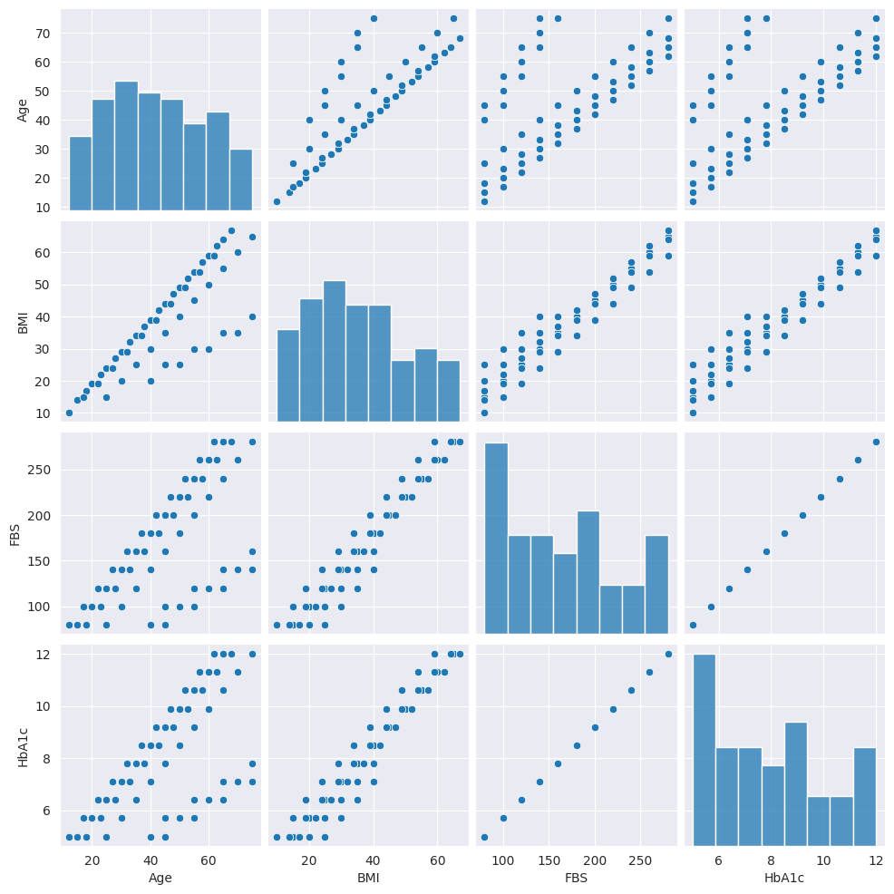
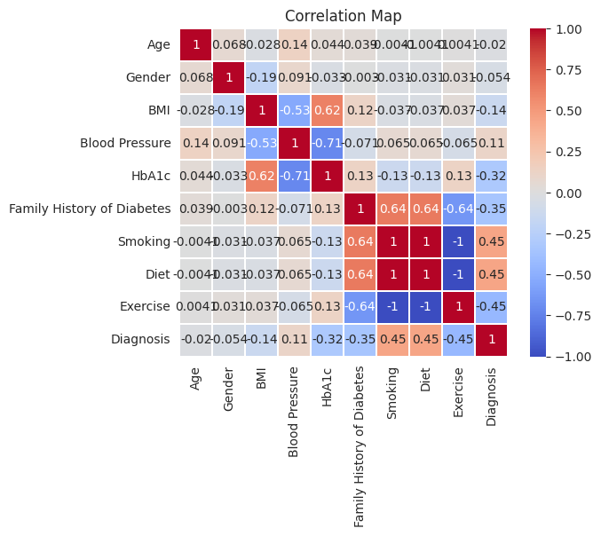
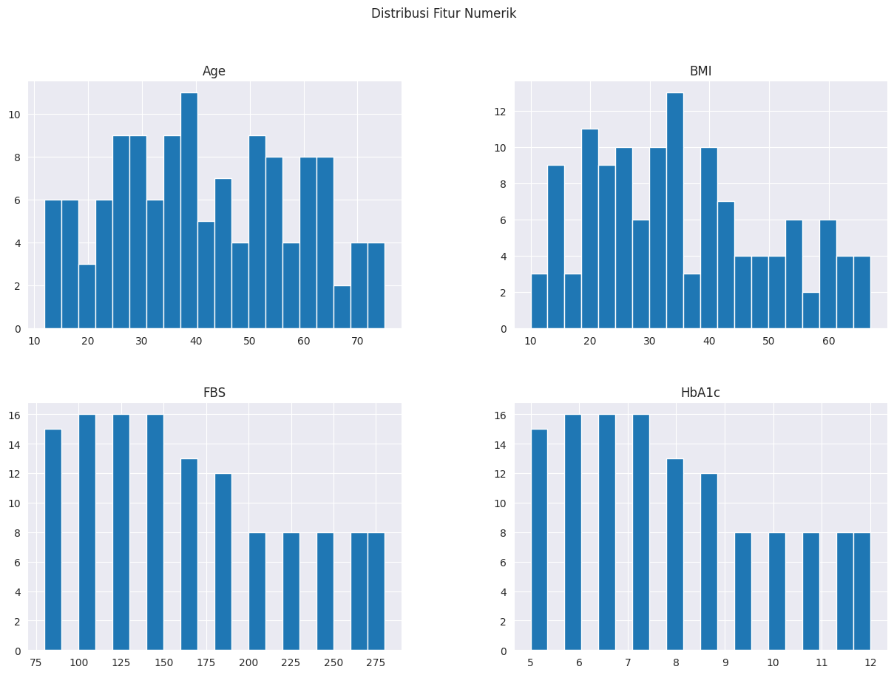
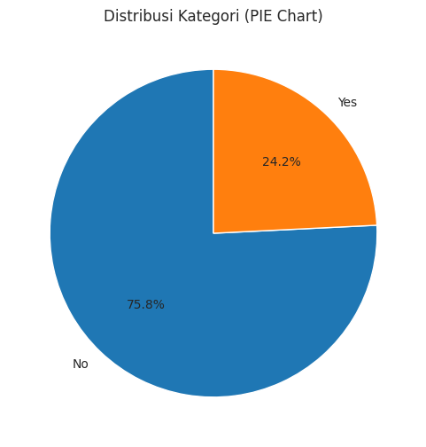
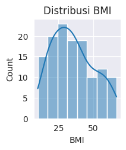
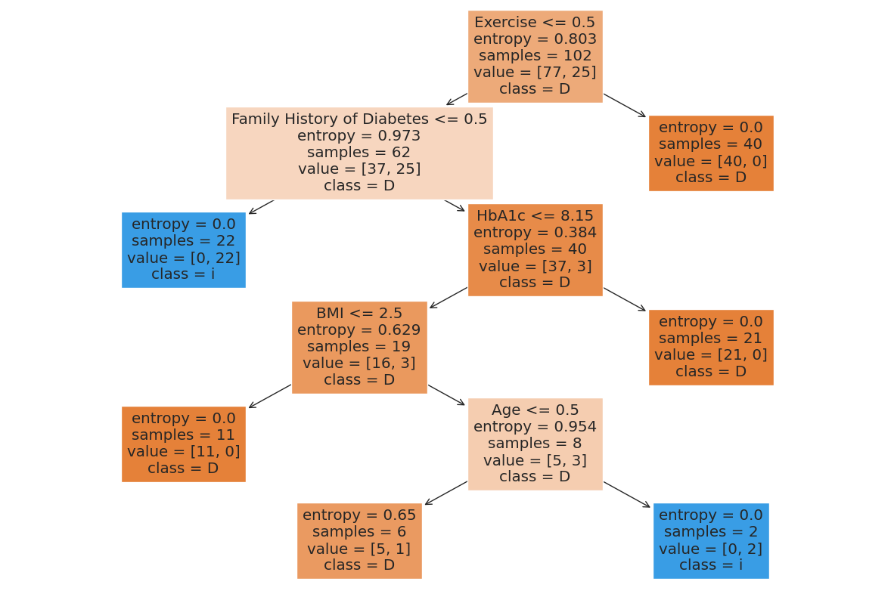

## Laporan Proyek Machine Learning
### Nama : An Nada Zakiyya Nabila
### Nim : 211351017
### Kelas : Malam A

## Domain Proyek
Proyek ini bertujuan untuk memprediksi terkait diabetes. Data yang digunakan mencakup informasi penyebab terjadinya diabetes. Dalam konteks ini model machine learning dapat digunakan untuk memprediksi apakah seseorang terdiagnosis atau tidak.
## Business Understanding
Pada model ini kita dapat mengklasifikasi risiko seseorang terdiagnosis atau tidak terhadap diabetes berdasarkan faktor-faktor serta gejala yang dialami oleh pasien. Dalam upaya untuk meningkatkan pencegahan diabetes ini perlunya memahami prediksi dini risikp seseorang mengembangkan penyakit ini. Oleh karena dikumpulkan nya datasetyang mencakup informasi kesehatan individu untuk membangun model yang dibuat.
### Problem Statements
Berdasarkan dataset diabetes yang dimiliki,kita kesulitan dalam mengklasifikasi risiko diabetes pada individu dengan faktor risiko seperti usia,BMI yang tinggi,tekanan darah dan lain sebagainya.
### Goals
Menentukan risiko kesehatan yang paling signifikan dalam prediksi diabetes untuk memastikan model fokus pada informasi yang revelan dan akurat sehingga memudahkan untuk pengambilan keputusan.
### Solution Statements
Mengembangkan model ini dengan menggunakan algoritma machine learning yang dapat mengenali pola dan hubungan antara faktor risiko dengan kemungkinan diabetes dan untuk validasi hasil prediksi.
## Data Understanding
Dataset yang digunakan untuk menyelesaikan permasalahan yang sudah dijabarkan yaitu 'Diabetes Classification' yang di dapatkan dari website Kaggle. Dataset ini memiliki 10 kolom dan 128 baris. Berikut Link menuju dataset
(https://www.kaggle.com/datasets/sujithmandala/easiest-diabetes-classification-dataset/data)

## Variabel-variabel pada Diabetes Classification dataset adalah sebagai berikut :
- Umur: Usia pasien, dalam tahun.
- Jenis Kelamin: Jenis kelamin pasien, laki-laki atau perempuan.
- BMI: Indeks massa tubuh (BMI) pasien, ukuran berat badan relatif terhadap tinggi badan.
- Tekanan Darah: Tekanan darah pasien, dalam mmHg.
- Gula Darah Puasa (FBS): Kadar gula darah puasa pasien, dalam mg/dL.
- HbA1c: Hemoglobin A1c pasien, ukuran kontrol gula darah selama 3 bulan terakhir.
- Riwayat Keluarga Diabetes: Apakah pasien memiliki riwayat keluarga diabetes.
- Merokok: Apakah pasien merokok.
- Diet: Apakah pasien memiliki diet yang buruk atau sehat.
- Olahraga: Apakah pasien berolahraga secara teratur.
- Diagnosis: Diagnosis pasien, baik diabetes atau tidak diabetes. 
## Data Preparation
### Data Colection
Data ini adalah informasi medis yang mencakup riwayat penyakit,faktor risiko,dan gejala pasien. Data ini berperan penting dalam upaya diagnosis dini dan pemahaman faktor-faktor yang berkontribusi terhadap penyakit diabetes.
Berikut langkah-langkah untuk data preparation,dimulai dari mendownload dataset dari kaggle 

```javascript
from google.colab import files
files.upload()
```
Buat direktori Kaggle menyalin file API Kaggle ke direktori tersebut dan untuk mengontentikasi akses API ke layanan Kaggle.

```javascript
!mkdir -p ~/.kaggle
!cp kaggle.json ~/.kaggle/
!chmod 600 ~/.kaggle/kaggle.json
!ls ~/.kaggle
```
Mengunduh dataset  dengan nama yang telah di download di website Kaggle.

```javascript
!kaggle datasets download -d sujithmandala/easiest-diabetes-classification-dataset
```
Membuat dan mengekstrak isi dari file ZIP ke dalamnya,proses ini mempersiapkan dataset tersebut untuk digunakan.

```javascript
!mkdir easiest-diabetes-classification-dataset
!unzip easiest-diabetes-classification-dataset
!ls easiest-diabetes-classification-dataset
```

Library yang digunakan untuk setiap analisis data dan pembuatan EDA sebagai berikut :

```javascript
import pandas as pd
import numpy as np
import matplotlib.pyplot as plt
import seaborn as sns
from sklearn.preprocessing import LabelEncoder
from sklearn.model_selection import train_test_split
from sklearn.tree import DecisionTreeClassifier
from sklearn.metrics import accuracy_score, classification_report, confusion_matrix
from sklearn import tree
import pickle
```

Tujuan data discovery untuk membantu pemmahaman lebih dalam tentang data dan menghasilkan pengambilan keputusan.

Kode ini berfungsi untuk membaca data file dari file CSV "Diabetes Classification.csv" dan menyimpannya dalam bentuk data frame.

```javascript
df = pd.read_csv('/content/Diabetes Classification.csv')
```
Menampilkan beberapa baris pertama dari data frame.

```javascript
df.head()
```
Informasi ringkas tentang struktur data tentang gambaran jumlah baris,kolom,tiap data setiap kolom dan jumlah nilai yang tidak null dalam setiap kolom.

```javascript
df.info()
```
Menunjukan banyak nya jumlah nilai null dalam setiap kolom.

```javascript
df.isnull().sum()
```
Memahami karakteristik umum dari data numerik dalam dataset yang mencakup seperti jumlah data,rata-rata,standar deviasi,nilai minimum dan lain sebagainya.

```javascript
df.describe()
```
Menghitung jumlah kemunculan setiap nilai unik dalam kolom'BMI'dalam data frame.

```javascript
df['BMI'].value_counts()
```
Menghitung jumlah kemunculan setiap nilai unik dalam kolom'Diagnosis'dalam data frame.

```javascript
df['Diagnosis'].value_counts()
```

```javascript
sns.set_style(style='darkgrid')
sns.pairplot(df)
plt.show()
```
 

Membuat dan mengatur gaya plot searbon menjadi'darkgrid' pairplot dari data frame.

```javascript
sns.heatmap(df.corr(numeric_only=True), linewidths=0.1, vmax=1.0, square=True, cmap='coolwarm', linecolor='white', annot=True).set_title("Correlation Map")
```


Menghasilkan matriks korelasi hanya untuk kolom numerik dan Menentukan lebar garis pemisah antar sel dan menentukan nilai maksimal.

```javascript
numeric_features = df.select_dtypes(include=['float64', 'int64']).columns
df[numeric_features].hist(bins=20, figsize=(15, 10))
plt.suptitle('Distribusi Fitur Numerik')
plt.show()
```


Mengambil dan menyimpan nama kolom-kolom numerik dalam variabel. Data di atas seperti AGe,BMI,FBS,dan HbA1c merupakan kolom numerik atau dataframe yang memiliki data numerik.

```javascript
df = pd.read_csv('/content/Diabetes Classification.csv')
kategori_counts = df['Diagnosis'].value_counts()

plt.figure(figsize=(6,6))
plt.pie(kategori_counts, labels=kategori_counts.index, autopct='%1.1f%%', startangle=90)
plt.title('Distribusi Kategori (PIE Chart)')
plt.show()
```

Menunjukan hasil distribusi yang ter diagnosis 'Yes' sebanyak 24.2% dan untuk yang terdiagnosis 'No' sebanyak 75.8%

```javascript
plt.subplot(2, 3, 6)
sns.histplot(df['BMI'], kde=True)
plt.title('Distribusi BMI')
```

Koordinat(0.5 , 1.0) menunjukkan posisi horizontal(x) dan vertikal(y) dari tengah bagian atas subplot.

Lakukan Preprocessing untuk mengubah data yang ada dan mempersiapkan data mentah agar dapat digunakan oleh model pembelajaran mesin atau untuk analisis data lebih lanjut.

Menentukan transformasi umur : 
- Anak-anak (0-12 tahun)
- Remaja (13-18 tahun)
- Dewasa (19-60 tahun)
- Lansia (>60 tahun)

```javascript
bins = [0, 12, 18, 60, float('inf')]
labels = ['Anak-anak', 'Remaja', 'Dewasa', 'Lansia']

df['Age'] = pd.cut(df['Age'], bins=bins, labels=labels, right=False)
```
Menentukan transformasi BMI :
- Kurus (0-18.5)
- Normal (18.6-24.9)
- Gemuk (25-29.9)
- Obesitas (>30)

```javascript
bins = [0, 18.5, 24.9, 29.9, float('inf')]
labels = ['Kurus', 'Normal', 'Gemuk', 'Obesitas']

df['BMI'] = pd.cut(df['BMI'], bins=bins, labels=labels, right=False)
```
Menghapus kolom'FBS'dari dataframe

```javascript
df=df.drop(['FBS'],axis=1)
```
 Menyimpan data kategoris atau nama kolom yang terkait dengan kategori serta data numerik dan melakukan operasi pada data numerik.

 ```javascript
 numerical = []
catgcol = []
 ```
 Mengisi nilai nilai yang hilang dalam suatu data frame.
 ```javascript
 for col in df.columns:
  if col in numerical:for col in df.columns:
  if df[col].dtype=='float64':
    numerical.append(col)
  else:
    catgcol.append(col)

    df[col].fillna(df[col].median(), inplace=True)
  else:
    df[col].fillna(df[col].mode()[0], inplace=True)
 ```
 Menguji apakah elemen tersebut'HbA1c'ada dalam daftar'numerical'

 ```javascript
 if 'HbA1c' in numerical:
    print('HbA1c is in the list of numerical values.')
else:
    print('HbA1c is not in the list of numerical values.')
 ```
 Mencari kolom tertentu dalam suatu data framedan menambahkan nama kolom ke dalam list'catgcol'

 ```javascript
 catgcol()
 ```
Mengubah nilai-nilai kategori dalam kolom yang terdapat dalam'catgcol'

```javascript
le = LabelEncoder()

for col in catgcol:
  df[col] = le.fit_transform(df[col])
```
Mengubah nilai nilai unik dalam kolom'Diagnosis' menjadi bilangan bulat dan mengubah kolom tersebut ditempat.

```javascript
df['Diagnosis'] = le.fit_transform(df['Diagnosis'])
```
Mengindentifikasi kolom independen dan dependen dalam suatu data frame dan menghasilkan list kolom yang tidak sama dengan'Diagnosis'.

```javascript
ind_col = [col for col in df.columns if col!= 'Diagnosis']
dep_col = 'Diagnosis'
```
Mengambil kolom dari suatu data frame. 'ind_col' variabel independen 'x' dan 'dep_col' variabel 'y' dari data frame.

```javascript
x = df[ind_col]
y = df[dep_col]
```
Membagi dataset menjadi subset pelatihan dan pengujian(train and test sets).

```javascript
x_train, x_test, y_train, y_test = train_test_split(x, y, test_size=0.2, random_state=42)
```

## Modeling
Kita akan membuat sebuah model Decision Tree Classifier.

Melatih model pada data pelatihan dan mengukur akurasi model pada data pengujian

```javascript
dtc = DecisionTreeClassifier(criterion='entropy',max_depth=5)
dtc.fit(x_train, y_train)

model = model = dtc.fit(x_train, y_train)
dtc_acc= accuracy_score(y_test,dtc.predict(x_test))

print("Train Set Accuracy:"+str(accuracy_score(y_train,dtc.predict(x_train))*100))
print("Test Set Accuracy:"+str(accuracy_score(y_test,dtc.predict(x_test))*100))
print(f'confusion matrix: \n{confusion_matrix(y_test, dtc.predict(x_test))}\n')
confusion = confusion_matrix(y_test, dtc.predict(x_test))
tn, fp, fn, tp = confusion.ravel()
print(f'classification report: {classification_report(y_test, dtc.predict(x_test))}')
```
Hasil akurasi training adalah 99% dan hasil akurasi testing 92%.

Memprediksi pasien yang di diagnosa mengidap diabetes dan tidak di diagnosa mengidap diabetes.

```javascript
input_data = (0,1,0,2,4.6,0,0,0,1)

input_data_as_numpy_array = np.array(input_data)

input_data_reshape = input_data_as_numpy_array.reshape(1,-1)

prediction = model.predict(input_data_reshape)
print(prediction)

if (prediction[0]==0):
    print ('Pasien di diagnosa tidak mengidap diabetes')
else:
    print ('Pasien di diagnosa mengidap diabetes')
```
Hasil yang diterima pasien di diagnosa tidak mengidap diabetes.

Visualisasi pohon keputusan yang telah dilatih oleh modele Decision Tree.

```javascript
fig = plt.figure(figsize=(15,10))
_ = tree.plot_tree(model,
                   feature_names=ind_col,
                   class_names=dep_col,
                   filled=True)
```


Tahap terakhir,simpan model Decision Tree ke dalam file pickle  dengan nama'Classification Diabetes.sav'

```javascript
filename ='Classification Diabetes.sav'
pickle.dump(model, open(filename, 'wb'))
```
